<div align="center">

# Timbre

**Two agents fight so your voice survives.**

A multi-agent content engine for technical founders. Researches what matters, writes in your voice, and verifies it didn't lie to sound better.

[**→ Live: usetimbre.ai**](https://usetimbre.ai) &nbsp;·&nbsp; [Architecture](#architecture) &nbsp;·&nbsp; [Specs](specs/) &nbsp;·&nbsp; [Demo](#demo)

</div>

---

## The bet

Technical content is the highest-ROI acquisition channel for B2B startups, and the channel AI categorically fails at — generic LLM output is detectable, and outsourced copy doesn't carry the founder's voice.

Timbre's bet: **voice preservation, not generation quality, is the missing primitive.** Build the engine the founder needs — one that fights to keep their voice through a long agentic pipeline.

## The demo moment

After Research streams its reasoning live and Write drafts an article, Voice rewrites it sentence-by-sentence to match the founder's tone. Then Verify — the second-pass agent — catches the moment Voice changes *"Vite builds in 1.2s"* to *"Vite builds instantly"* (sounds better; technically a lie), re-grounds the claim against the original Research evidence, and auto-corrects.

That's the fight. That's the whole product.

---

## Architecture

```mermaid
flowchart LR
    subgraph Persistent["Persistent (always on)"]
        S["Scout<br/><sub>Antigravity managed agent<br/>hourly cron</sub>"]
    end

    subgraph Pipeline["Pipeline (per article)"]
        direction LR
        C["Curate<br/><sub>Flash · low</sub>"]
        R["Research<br/><sub>Deep Research<br/>collaborative planning<br/>+ visualization</sub>"]
        W["Write<br/><sub>Flash · medium</sub>"]
        V["Voice<br/><sub>Flash · low<br/>+ emit_diff fn</sub>"]
        VR["Verify<br/><sub>Flash · high<br/>+ google_search<br/>+ flag_discrepancy fn</sub>"]
    end

    subgraph Multiplex["Multiplex (parallel fan-out)"]
        direction TB
        T["TTS bulletin"]
        B["Nano Banana carousel"]
        RA["AI Talk Radio"]
        VE["Veo hero clip"]
    end

    S -->|"candidates.json<br/>alerts.json"| C
    C -->|"top 3"| R
    R -.->|"plan_proposed<br/>(human approves)"| R
    R -->|"previous_interaction_id<br/>(research pack)"| W
    W -->|"previous_interaction_id<br/>(draft.md)"| V
    V -->|"previous_interaction_id<br/>+ voice.diff events"| VR
    VR -->|"final.md"| Multiplex

    classDef agent fill:#1B1E2B,stroke:#7FA98B,color:#F2EFE5
    classDef model fill:#13151E,stroke:#E8A574,color:#F2EFE5
    classDef tier2 fill:#13151E,stroke:#3a3a3a,color:#9398A8,stroke-dasharray: 4 4
    class S,R agent
    class C,W,V,VR,T,B model
    class RA,VE tier2
```



Dashed nodes are Tier 2 (optional flourish). Solid lines are real `previous_interaction_id` chains carrying conversation history server-side.

---

## How the pieces work

| # | Stage | Powered by | What it does | Visible to user |
|---|---|---|---|---|
| 1 | **Scout** | `antigravity-preview-05-2026` registered as managed agent `timbre_scout` | Runs hourly in a persistent Linux sandbox. Scans RSS/HN/arXiv/X, scores candidates against Voice DNA, persists state to `candidates.json` + `alerts.json`. | File-tree timestamps + ranked candidates + 0.94 alert at 3:42 AM |
| 2 | **Curate** | `gemini-3.5-flash` · `thinking_level: low` | Picks top 3 candidates by combined voice-fit + novelty score. | Top-3 cards |
| 3 | **Research** | `deep-research-preview-04-2026` with `collaborative_planning: true` and `visualization: auto` | Proposes a research plan, accepts on-stage edits, then streams thoughts + search queries + agent-generated charts. | Plan modal · live reasoning · charts inline |
| 4 | **Write** | `gemini-3.5-flash` · `thinking_level: medium` · chains via `previous_interaction_id` | Drafts a comprehensive technical post from the research evidence. | Tokens streaming left column |
| 5 | **Voice** | `gemini-3.5-flash` · `thinking_level: low` · custom `emit_diff` function tool | Rewrites span-by-span to match founder voice. Emits per-span diffs with reasons. | Tokens streaming right column + inline diff highlights |
| 6 | **Verify** | `gemini-3.5-flash` · `thinking_level: high` · combines `google_search` + `url_context` + `code_execution` + `flag_discrepancy` function | Compares the voice rewrite against the original Research evidence. Catches drift introduced by voice transfer. Re-grounds with fresh URL fetches. | Red flash on drift span → green resolution |
| 7 | **Multiplex** | Parallel fan-out: `gemini-2.5-flash-preview-tts`, `gemini-3-pro-image-preview` (Nano Banana), AI Talk Radio (Tier 2), Veo (Tier 2 stretch) | One verified article → audio bulletin + 3-slide social carousel + radio segment + hero clip. | Multiplex board with playable cards |

### The novel bit: sandbox → UI bridge

Antigravity managed agents have no webhook, no shared mount, no host-side file API. The only way to surface state from a long-running agent is its `output_text`. Timbre solves this with a **sentinel print contract** that's part of Scout's `AGENTS.md`:

```bash
echo "<<<TIMBRE_TICK_START>>>"
echo '{"tick_id":"'"$(uuidgen)"'","at":"'"$(date -u +%Y-%m-%dT%H:%M:%SZ)"'"}'
echo "---CANDIDATES_COUNT---"
jq -c '.candidates | length' /workspace/candidates.json
echo "---CANDIDATES_HEAD---"
jq -c '.candidates[0:5]' /workspace/candidates.json
echo "---ALERTS---"
jq -c '.alerts // []' /workspace/alerts.json
echo "---LS---"
ls -la --time-style=full-iso /workspace
echo "<<<TIMBRE_TICK_END>>>"
```

Backend parses the last `<<<TIMBRE_TICK_END>>>` block from `interaction.output_text`, splits on `---SECTION---` markers, JSON-parses each section. Cheap, deterministic, demos great.

---

## Google primitives composed

Seven Google AI primitives doing load-bearing work — not decoration:

| Primitive | Where it lives |
|---|---|
| **Antigravity Agent** (`antigravity-preview-05-2026`) | Scout — persistent Linux sandbox with state across hourly ticks |
| **Managed Agents** (`agents.create()`) | `timbre_scout` registered as a named, reusable managed agent |
| **Deep Research Agent** (`deep-research-preview-04-2026`) | Research stage — collaborative planning, visualization, MCP-ready |
| **Interactions API** | Every stage call; `previous_interaction_id` chaining for free history |
| **Combined tool use** (`google_search` + `url_context` + `code_execution` + custom fn) | Verify stage — fact-check loop with re-grounding |
| **Multimodal multiplex** (Gemini TTS + Nano Banana image gen) | Article → audio + slides in parallel |
| **`Api-Revision: 2026-05-20`** strict pinning | Production-grade schema discipline against beta API |

---

## Demo

[**→ usetimbre.ai**](https://usetimbre.ai) — live dashboard

Demo video: *recording at 4:30pm PDT; link landing here after submission*

The 3-minute demo plays in five beats — see [`specs/demo-script.md`](specs/demo-script.md) for the verbatim narration.

---

## Repo layout

```
timbre/                                  ← benikigai/timbre
├── specs/                               ← Source-of-truth docs (read 99-handoff.md first)
│   ├── 00-master.md                    ← Locked decisions, stage map, agent/model pins
│   ├── api-contracts.md                ← SSE events + REST + JSON file schemas
│   ├── 01-back.md                      ← Backend implementation guide
│   ├── 02-front.md                     ← Frontend implementation guide
│   ├── 03-tools.md                     ← Scout config + demo cache
│   ├── demo-script.md                  ← 3-min stage script
│   ├── MINIMUM-VIABLE.md               ← 3.5h scope cut
│   └── 99-handoff.md                   ← Entry point for any new contributor
├── packages/
│   ├── shared/src/contracts/           ← Zod schemas — single source of truth for types
│   ├── backend/                        ← Express + SSE + Interactions API orchestrator
│   └── frontend/                       ← Vite + React + Vercel AI SDK · sage/amber dark
├── data/cache/agentic-web-infra/       ← Demo cache fixtures (SSE replay + assets)
└── public/                             ← Landing page assets (deployed at usetimbre.ai)

benikigai/timbre-scout-config           ← Separate repo, mounted into Scout's sandbox
├── AGENTS.md                           ← Scout role + REQUIRED tick protocol
├── .agents/skills/                     ← 3 skills auto-loaded by Antigravity
│   ├── source_scanning/SKILL.md
│   ├── topic_scoring/SKILL.md
│   └── voice_profile/SKILL.md
├── sources.yaml                        ← 8 sources to scan per tick
└── voice_corpus/                       ← Founder's past writing (markdown)
```

---

## Run locally

```bash
# 1. Clone + install
git clone https://github.com/benikigai/timbre.git
cd timbre
(cd packages/shared && npm i)
(cd packages/backend && npm i)
(cd packages/frontend && npm i)

# 2. Set GEMINI_API_KEY in packages/backend/.env
echo "GEMINI_API_KEY=your_key_here" > packages/backend/.env

# 3. Boot both panes
(cd packages/backend && npm run dev) &      # :3000
(cd packages/frontend && npm run dev) &     # :5173

# 4. Trigger a real Scout tick (one-time, ~3 min)
curl -X POST http://localhost:3000/api/scout/trigger

# 5. Start a run
open http://localhost:5173
```

---

## Key technical decisions

| | What | Why |
|---|---|---|
| **D1** | 7-stage pipeline (Scout → Curate → Research → Write → Voice → Verify → Multiplex) | Brief is canonical; superseded the original 4-agent PRD |
| **D4** | Sandbox→UI bridge via end-of-tick JSON print w/ `<<<TIMBRE_TICK_END>>>` sentinel | Antigravity has no webhook/mount; only `output_text` is reachable |
| **D5** | UI "Cancel" pauses SSE replay only; backend keeps spending tokens | No documented Interactions API cancel endpoint as of `Api-Revision: 2026-05-20` |
| **D6** | Cache-replay fallback engages auto on streaming stall >8s | Demo-safe path is mandatory for a 3-min stage slot |
| **D7** | Multiplex Tier 1 (TTS + Banana) ships; Tier 2 (Radio + Veo) optional | Risk-bucketed per cost + reliability |
| **D10** | Sage + amber + gold on warm-dark `#0D110F` | Distinct from default Google palette; demo-friendly on bright screens |

Full decision log: [`specs/00-master.md` §2](specs/00-master.md).

---

## Hackathon

**Cerebral Valley × Google DeepMind I/O Hackathon** — Saturday, May 23, 2026, San Francisco.

Built in one day on the Gemini 3.5 Flash GA release. Submitted at 5pm PDT.

Categories of interest: **Best Use of Managed Agents** (Interactions API + Antigravity).

---

## License

Private. Public after demo if there's interest — ping [@benikigai](https://github.com/benikigai).
