<div align="center">

# Timbre

**Two agents fight so your voice survives.**

A multi-agent content engine for technical founders. Researches what matters, writes in your voice, and verifies it didn't lie to sound better.

[**Live landing → usetimbre.ai**](https://usetimbre.ai) &nbsp;·&nbsp; [**Live dashboard → usetimbre.ai/app**](https://usetimbre.ai/app) &nbsp;·&nbsp; [Architecture](#architecture) &nbsp;·&nbsp; [Specs](specs/) &nbsp;·&nbsp; [Submission](SUBMISSION.md)

</div>

---

## The bet

Technical content is the highest-ROI acquisition channel for B2B founders — and the channel AI categorically fails at. Generic LLM output is detectable. Outsourced copy doesn't carry the founder's voice. Style-transfer tools silently mangle technical facts to sound smoother.

Timbre's bet: **voice preservation, not generation quality, is the missing primitive.** Build the engine the founder needs — one that fights to keep their voice through a long agentic pipeline.

## The demo moment

After Research streams its reasoning live and Write drafts an article, Voice rewrites it sentence-by-sentence to match the founder's tone. Then Verify — the second-pass agent — catches the moment Voice changes *"Vite builds in 1.2s"* into *"Vite builds instantly"* (sounds better; technically a lie), re-grounds the claim against the original Research evidence via `google_search` + `url_context`, and auto-corrects.

That's the fight. That's the whole product.

---

## Architecture

```mermaid
flowchart LR
    subgraph Persistent["Persistent (always on)"]
        S["Scout<br/><sub>Antigravity managed agent<br/>timbre_scout</sub>"]
    end

    subgraph Pipeline["Pipeline (per article)"]
        direction LR
        C["Curate<br/><sub>Flash · low</sub>"]
        R["Research<br/><sub>Deep Research<br/>collaborative planning<br/>+ visualization</sub>"]
        W["Write<br/><sub>Flash · medium<br/>+ EditableDraft (human-in-loop)</sub>"]
        V["Voice<br/><sub>Flash · low<br/>+ emit_diff fn<br/>+ editable VoiceProfile</sub>"]
        VR["Verify<br/><sub>Flash · high<br/>+ google_search<br/>+ flag_discrepancy fn</sub>"]
    end

    subgraph Multiplex["Multiplex (parallel fan-out — all four ship)"]
        direction TB
        T["TTS bulletin<br/><sub>gemini-2.5-flash-preview-tts</sub>"]
        B["Nano Banana carousel<br/><sub>gemini-3-pro-image-preview</sub>"]
        RA["AI Talk Radio segment"]
        VE["Veo hero clip"]
    end

    S -->|"candidates.json<br/>alerts.json"| C
    C -->|"top 3"| R
    R -.->|"plan_proposed<br/>(human approves)"| R
    R -->|"previous_interaction_id<br/>(research pack)"| W
    W -->|"previous_interaction_id<br/>(draft.md)"| V
    V -->|"previous_interaction_id<br/>+ voice.diff events"| VR
    VR -->|"final.md"| Multiplex

    classDef agent fill:#1B1E2B,stroke:#7FA98B,color:#F2EFE5
    classDef model fill:#13151E,stroke:#E8A574,color:#F2EFE5
    class S,R agent
    class C,W,V,VR,T,B,RA,VE model
```



Solid lines are real `previous_interaction_id` chains carrying conversation history server-side. The plan-approval gate (dashed) is the live interactive moment on stage.

---

## How the pieces work

| # | Stage | Powered by | What it does | Visible to user |
|---|---|---|---|---|
| 1 | **Scout** | `antigravity-preview-05-2026` registered as managed agent `timbre_scout` via `agents.create()` | Triggered by `POST /api/scout/trigger`. Provisions a Linux sandbox forked from the registered agent's base environment, clones the [scout-config repo](https://github.com/benikigai/timbre-scout-config) into `/workspace/`, scans RSS/HN/arXiv/X via `google_search` + `url_context`, scores candidates against the founder's Voice DNA, persists `candidates.json` + `alerts.json` + `seen.txt` to the sandbox filesystem. Surfaces state via end-of-tick sentinel print (see [novel bit](#the-novel-bit-sandbox--ui-bridge)). | ScoutPanel sidebar: env_id, tick history, raw `ls -la --time-style=full-iso /workspace`, ranked candidates with scores, alert pill |
| 2 | **Curate** | `gemini-3.5-flash` · `thinking_level: low` | Picks top 3 candidates by combined voice-fit + novelty score (deterministic; rubric in scout-config's `topic_scoring/SKILL.md`). | Top-3 cards, clickable |
| 3 | **Research** | `deep-research-preview-04-2026` with `agent_config: {type: "deep-research", collaborative_planning: true, visualization: "auto"}` | Proposes a research plan, accepts on-stage edits via `POST /api/runs/:id/plan-approval`, then streams thoughts + search queries + agent-generated charts. Founder's past posts pass as `document` inputs to bias toward their angles. | PlanApprovalModal · live reasoning · charts inline · ActivityFeed for every tool call |
| 4 | **Write** | `gemini-3.5-flash` · `thinking_level: medium` · chains via `previous_interaction_id` (no manual context re-serialization) | Drafts a comprehensive technical post from the chained research evidence. **EditableDraft** lets the founder rewrite any paragraph before Voice runs. | Tokens streaming left column · click-to-edit any paragraph |
| 5 | **Voice** | `gemini-3.5-flash` · `thinking_level: low` · custom `emit_diff` function tool · loads editable Voice DNA from `voice_dna.json` | Rewrites span-by-span to match founder voice. Emits per-span diffs with reasons via `emit_diff` callbacks. **VoiceProfileModal** lets the founder tune the DNA mid-run; backend persists via `POST /api/voice-profile`. | DiffView split-screen with inline highlights · live VoiceProfile panel |
| 6 | **Verify** | `gemini-3.5-flash` · `thinking_level: high` · combined tool use: `google_search` + `url_context` + `code_execution` + custom `flag_discrepancy` function | Compares the voice rewrite against the original Research evidence. Catches drift introduced by voice transfer. Re-grounds with fresh URL fetches. | VerifyOverlay bottom-right: original claim vs drift vs auto-corrected text · red flash → green resolution |
| 7 | **Multiplex** | Parallel fan-out · all four ship live: `gemini-2.5-flash-preview-tts` (Puck voice), `gemini-3-pro-image-preview` (Nano Banana carousel), AI Talk Radio segment, Veo hero clip · **live refinement** via `POST /api/multiplex/refine` lets you re-direct each asset | One verified article → audio bulletin + 3-slide carousel + radio segment + hero clip, all in parallel. Each card supports a refinement input ("make slide 2 emphasize cold-start"). | MultiplexBoard: 4 cards w/ playable assets + direction-input refinement |

### The novel bit: sandbox → UI bridge

Antigravity managed agents have no webhook, no shared mount, no host-side file API. The only way to surface state from a long-running managed agent is its `output_text`. Timbre solves this with a **sentinel print contract** that lives in Scout's `AGENTS.md`:

```bash
echo "<<<TIMBRE_TICK_START>>>"
echo '{"tick_id":"'"$(uuidgen)"'","at":"'"$(date -u +%Y-%m-%dT%H:%M:%SZ)"'"}'
echo "---CANDIDATES_COUNT---"
jq -c '.candidates | length' /workspace/candidates.json
echo "---CANDIDATES_HEAD---"
jq -c '.candidates[0:5]' /workspace/candidates.json
echo "---ALERTS---"
jq -c '.alerts // []' /workspace/alerts.json
echo "---LS---"
ls -la --time-style=full-iso /workspace
echo "<<<TIMBRE_TICK_END>>>"
```

Backend parses the last `<<<TIMBRE_TICK_END>>>` block from `interaction.output_text`, splits on `---SECTION---` markers, JSON-parses each section. Cheap, deterministic, demos great. The verbatim `ls -la` block becomes the cold-open prop — judges can probe `client.agents.get("timbre_scout")` to verify it's a real registered managed agent, not a panel with labels.

---

## Google primitives composed (all load-bearing)

| Primitive | Where it lives in the build |
|---|---|
| **Antigravity Agent** (`antigravity-preview-05-2026`) | Scout — persistent Linux sandbox with hourly state accumulation |
| **Managed Agents** (`agents.create()`) | `timbre_scout` registered as a named, reusable managed agent |
| **Deep Research Agent** (`deep-research-preview-04-2026`) | Research stage — collaborative planning + visualization + streaming thoughts |
| **Interactions API** | Every stage; `previous_interaction_id` chaining for free server-side history |
| **Combined tool use** | Verify: `google_search` + `url_context` + `code_execution` + custom `flag_discrepancy` fn in one request |
| **Custom function tools** | Voice's `emit_diff` callback + Verify's `flag_discrepancy` callback |
| **Multimodal generation** | TTS (`gemini-2.5-flash-preview-tts`) + Nano Banana (`gemini-3-pro-image-preview`) + Veo + AI Talk Radio |
| **Schema discipline** | `Api-Revision: 2026-05-20` pinned, `@google/genai` v2.6+ pinned, `thinking_level` enum-only (no temperature on Gemini 3.x) |

---

## Live vs cached on demo day (honest)

The 3-min demo window doesn't accommodate Research's natural 2–20 min execution. Three stages run live every demo; four are real-Gemini-pre-baked and replayed via SSE cache.

| Stage | Demo day | Notes |
|---|---|---|
| Scout | **LIVE** | Real `agents.create()` + real tick every demo (~3 min wall, scored 5 alerts max-1.00 in last run including "BambuStudio violating PrusaSlicer AGPL") |
| Curate | **LIVE** | Real Flash call, ~3s |
| Research plan | **LIVE** | Real Deep Research call w/ `collaborative_planning: true`, ~30s — the on-stage modify-and-approve moment is real API |
| Research execution | cached replay | Real Gemini-Deep-Research run from earlier, replayed at `REPLAY_SPEED=2.5` |
| Write | cached replay | `draft.md` is real Flash output (generated by Antigravity terminal pre-demo), tokens replay via SSE |
| Voice | cached replay | `rewrite.md` + `voice-diffs.json` are real Flash outputs; 8 diffs validated against Zod |
| Verify | cached replay | `final.md` has the seeded drift corrected; discrepancy event replays |
| Multiplex (all 4) | cached assets | `tts.mp3` (Puck, 1m 08s), 3 carousel PNGs (1080×1350), Veo clip, Radio segment — all generated via real Gemini calls and served as static files. Live refinement re-runs against real models. |

Every artifact you see in the demo is real Gemini output. Three of the seven stages exercise the live API path during the recording. The other four would too if Research execution fit in 3 minutes.

---

## Demo

- **Live dashboard:** [usetimbre.ai/app](https://usetimbre.ai/app) — both demo modes (cached replay + live run) selectable on the landing.
- **Demo video:** [`data/cache/demo-final.mp4`](data/cache/demo-final.mp4) (49s, 1638×934, h264) — uploaded to YouTube unlisted; URL in `SUBMISSION.md`.
- **3-min stage script:** [`specs/demo-script.md`](specs/demo-script.md) — verbatim narration with fallback paths per beat.

---

## Repo layout

```
timbre/                                  ← benikigai/timbre
├── README.md                            ← this file
├── SUBMISSION.md                        ← Cerebral Valley hackathon submission text
├── specs/                               ← Source-of-truth docs (read 99-handoff.md first)
│   ├── 00-master.md                     ← Locked decisions, stage map, agent/model pins
│   ├── api-contracts.md                 ← SSE events + REST + JSON file schemas
│   ├── 01-back.md                       ← Backend implementation guide
│   ├── 02-front.md                      ← Frontend implementation guide
│   ├── 03-tools.md                      ← Scout config + demo cache + smoke tests
│   ├── demo-script.md                   ← 3-min stage script
│   ├── MINIMUM-VIABLE.md                ← 3.5h scope cut (what actually shipped)
│   ├── YOLO-{BACK,FRONT,TOOLS,ANTIGRAVITY}.md  ← Per-terminal /yolo prompts
│   └── 99-handoff.md                    ← Entry point for any new contributor
├── packages/
│   ├── shared/src/contracts/            ← Zod schemas — single source of truth for types
│   │   ├── stage.ts                     ← StageId + AGENTS/MODELS constants + STAGE_CONFIG
│   │   ├── files.ts                     ← Candidate, Alert, VoiceProfile, VoiceDiff, ...
│   │   ├── events.ts                    ← 24 SSE event types + EventTypeMap + safeParseEvent
│   │   ├── rest.ts                      ← Request/response schemas for every endpoint
│   │   └── index.ts
│   ├── backend/                         ← Express + SSE + Interactions API orchestrator
│   │   └── src/
│   │       ├── server.ts                ← Express boot, CORS, route mount
│   │       ├── env.ts                   ← Zod-validated process.env
│   │       ├── bus/{eventLog,replay}.ts ← SSE event bus + cache fixture replay engine
│   │       ├── pipeline/                ← Per-stage modules + run orchestrator
│   │       │   ├── stages/{scout,curate,research}.ts
│   │       │   ├── run.ts               ← Orchestrator: live stages → cache handoff
│   │       │   ├── planApproval.ts      ← Suspends Research until /plan-approval POST
│   │       │   ├── parseTickBlock.ts    ← Parses Scout's <<<TIMBRE_TICK_END>>> sentinel
│   │       │   └── voiceProfileApproval.ts
│   │       ├── routes/                  ← /api/{runs,scout,events,voice-profile,multiplex,refine,talk-radio,veo}
│   │       ├── genai/client.ts          ← @google/genai singleton + Api-Revision header
│   │       └── generate-{tts,articles,voice-diffs}.ts  ← Asset generation scripts (Antigravity)
│   └── frontend/                        ← Vite 8 + React 19 + Tailwind 4 + Vercel AI SDK
│       └── src/
│           ├── App.tsx                  ← React Router, basename="/app"
│           ├── AppShell.tsx
│           ├── pages/{LandingPage,DemoPage}.tsx
│           ├── components/              ← ScoutPanel, DiffView, VerifyOverlay, MultiplexBoard,
│           │                              EditableDraft, VoiceProfileModal, ActivityFeed,
│           │                              ProofBeat, PlanApprovalModal, ErrorBoundary, ...
│           ├── hooks/                   ← useEventStream, useRunEvents, useScoutEvents,
│           │                              useScoutState, useRunStateMachine
│           ├── state/{runReducer,runStateTypes}.ts  ← useReducer over AnyEvent
│           ├── theme/tokens.ts          ← Sage + amber + gold tokens
│           └── primitives/{GlassPanel,PulsingDot,DiffSpan}.tsx
├── data/cache/agentic-web-infra/        ← Demo cache fixtures
│   ├── events.ndjson                    ← 47-event SSE replay (~1MB)
│   ├── draft.md / rewrite.md / final.md ← Real Flash outputs
│   ├── voice-diffs.json                 ← 8 validated VoiceDiffs incl. seeded drift
│   └── multiplex/{tts.mp3, carousel/*.png, radio.*, veo.*}
├── data/cache/{scout-state.json,demo-final.mp4}
└── public/                              ← Landing page (deployed at usetimbre.ai/)

benikigai/timbre-scout-config            ← Separate repo, mounted into Scout's sandbox per tick
├── AGENTS.md                            ← Scout role + REQUIRED tick protocol w/ sentinel block
├── .agents/skills/{source_scanning,topic_scoring,voice_profile}/SKILL.md
├── sources.yaml                         ← 8 sources to scan per tick (HN, arXiv, RSS, X)
├── voice_corpus/*.md                    ← Founder's past writing
└── voice_dna.json                       ← Rich Voice DNA (tone, sentence patterns, forbidden jargon, structural patterns, punctuation signature)
```

---

## Run locally

```bash
# 1. Clone + install
git clone https://github.com/benikigai/timbre.git
cd timbre
(cd packages/shared && npm i)
(cd packages/backend && npm i)
(cd packages/frontend && npm i)

# 2. Set GEMINI_API_KEY in packages/backend/.env
echo "GEMINI_API_KEY=your_key_here" > packages/backend/.env

# 3. Boot both panes (backend :3001, frontend :5173)
(cd packages/backend && npm run dev) &
(cd packages/frontend && npm run dev) &

# 4. (Optional) Trigger a real Scout tick — ~3 min, costs ~$0.30-1.00
curl -X POST http://localhost:3001/api/scout/trigger

# 5. Open the dashboard
open http://localhost:5173/app
```

Vite dev proxies `/api → localhost:3001`, so the frontend talks to the backend on the same origin during dev.

---

## API surface (deployed)

All routes live at `https://usetimbre.ai/api/...`.

| Endpoint | Purpose |
|---|---|
| `GET /api/healthz` | Liveness |
| `POST /api/runs` | Start a pipeline run (`{topic, mode: 'live' \| 'cached', cache_fixture?}`) |
| `GET /api/runs/:run_id/events` | SSE stream for that run |
| `POST /api/runs/:id/plan-approval` | Approve/modify Deep Research plan |
| `POST /api/runs/:id/cancel` | Pause SSE replay (tokens keep accruing — no documented Interactions API cancel) |
| `GET /api/scout/state` | Latest Scout snapshot (candidates + alerts + tick history + raw stdout) |
| `POST /api/scout/trigger` | Manually fire a Scout tick |
| `GET /api/scout/events` | SSE stream for Scout lifecycle |
| `GET /api/cache/:fixture` | Static cache asset (TTS, carousel, etc.) |
| `POST /api/voice-profile` | Update editable Voice DNA mid-run |
| `POST /api/multiplex/refine` | Re-run a multiplex job (TTS / carousel) with new direction |
| `POST /api/refine` | Voice-rewrite refinement after VoiceProfile edit |
| `POST /api/talk-radio` | Tier-2 multiplex: AI Talk Radio segment |
| `POST /api/veo` | Tier-2 multiplex: Veo hero clip |

Full event/REST contracts: [`specs/api-contracts.md`](specs/api-contracts.md). TypeScript mirror: [`packages/shared/src/contracts/`](packages/shared/src/contracts/).

---

## Key decisions (excerpt)

| | What | Why |
|---|---|---|
| **D1** | 7-stage pipeline (Scout → Curate → Research → Write → Voice → Verify → Multiplex) | Brief is canonical; original 4-agent PRD superseded |
| **D4** | Sandbox→UI bridge via end-of-tick JSON print w/ `<<<TIMBRE_TICK_END>>>` sentinel | Antigravity has no webhook/mount; only `output_text` is reachable |
| **D5** | UI "Pause output" pauses SSE replay only; backend keeps spending tokens | No documented Interactions API cancel endpoint as of `Api-Revision: 2026-05-20` |
| **D6** | Cache-replay fallback engages auto on streaming stall >8s | Demo-safe path is mandatory for a 3-min stage slot |
| **D7** | All four multiplex jobs ship live (TTS + Carousel + Radio + Veo) — Tier 2 promoted from "optional" mid-build | Antigravity smoke-tested all four primitives and they worked first try |
| **D10** | Sage + amber + gold on warm-dark `#0D110F`; Fraunces display + Inter Tight body + JetBrains Mono | Distinct from default Google palette; warm-dark holds up on bright projection screens |

Full decision log: [`specs/00-master.md` §2](specs/00-master.md).

---

## Built in one day (24h hackathon)

Four parallel terminals against locked Zod contracts:

| Terminal | Powered by | What it shipped |
|---|---|---|
| **Spec / integration** | Claude Opus 4.7 | 8 spec docs (~2,000 lines), 5 Zod contract files, integration smoke tests, README + SUBMISSION |
| **Back** | Claude Opus 4.7 (`/yolo specs/YOLO-BACK.md`) | Express + SSE bus + per-stage Interactions API impls + cache replay + 12 routes |
| **Front** | Claude Opus 4.7 (`/yolo specs/YOLO-FRONT.md`) | 18 React components + 5 hooks + state reducer + two pages + visual identity polish |
| **Multimodal assets** | Antigravity (Gemini 3.5 Flash) | Smoke-verified TTS + Banana model IDs, generated `tts.mp3` + 3 carousel PNGs + `draft.md` + `rewrite.md` + `final.md` + 8 validated voice diffs |

Coordination overhead near-zero because contracts were frozen in `packages/shared/src/contracts/` before any pane started building.

---

## Hackathon

**Cerebral Valley × Google DeepMind I/O Hackathon** — Saturday, May 23, 2026, San Francisco.

Built in one day on the Gemini 3.5 Flash GA release. Submitted at 5pm PDT.

Category: **Best Use of Managed Agents** (Interactions API + Antigravity).

See [`SUBMISSION.md`](SUBMISSION.md) for the full submission write-up.

---

## License

TBD — public for hackathon judging. Drop a note to [@benikigai](https://github.com/benikigai) if you want to use it commercially.
